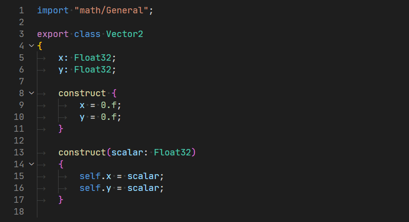
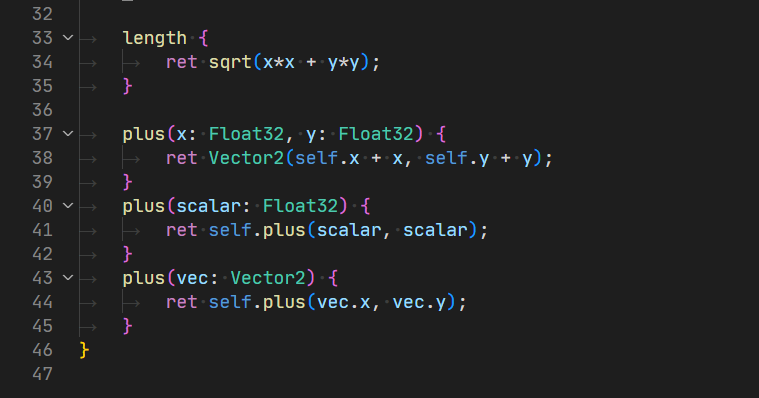

# vscode-rigc

A Visual Studio Code extension for the [RigC language](https://github.com/PoetaKodu/rigc-lang).

## Features

### Basic syntax highlighting

## Requirements

None.
## Extension Settings

None yet.
## Known Issues

Because the syntax is in progress, the colorization might be wrong.

## Release Notes

### 0.1.0

Added basic highlighting.
